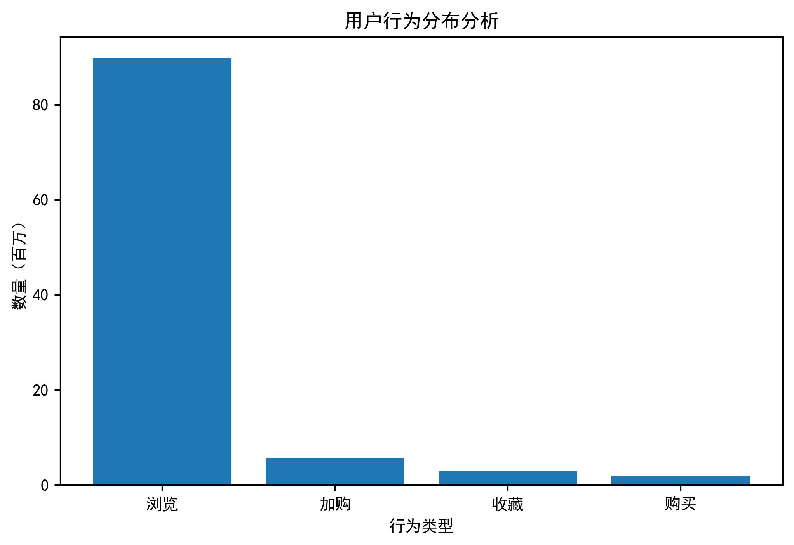
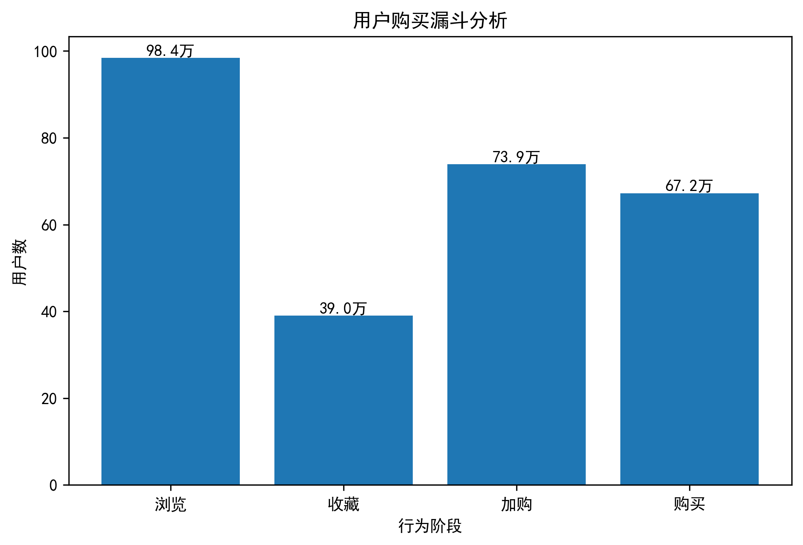
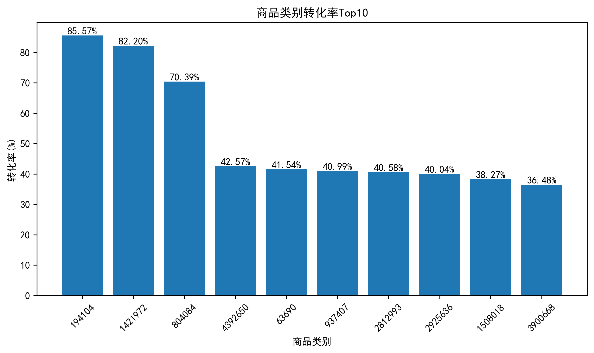
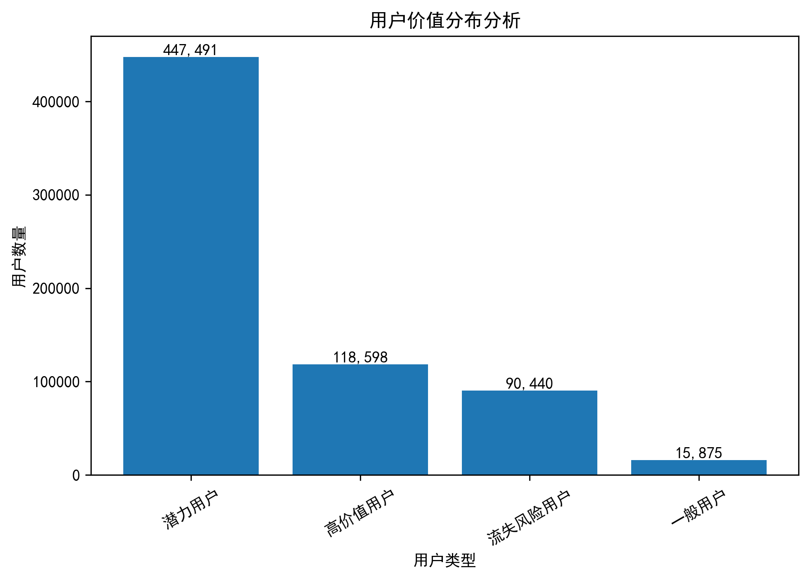

# Ecommerce User Behavior Analysis & Customer Segmentation


## Project Overview

本项目基于电商用户行为数据，围绕用户行为分析、商品类别分析以及用户价值分析三个方向展开研究。

通过分析用户浏览（PV）、收藏（Fav）、加购（Cart）、购买（Buy）等行为数据，探索用户在电商平台中的行为特征、购买转化路径以及不同用户群体的价值差异。

项目使用 MySQL 完成数据处理、指标构建与分析计算，并结合 Python（Pandas、Matplotlib）完成数据分析和可视化展示，形成完整的数据分析流程。


---

## Technology Stack

- MySQL
- Python
- Pandas
- Matplotlib
- Jupyter Notebook


---

## Dataset Description

本项目使用公开电商用户行为数据集。

主要字段：

| 字段 | 说明 |
| --- | --- |
| user_id | 用户唯一标识 |
| item_id | 商品唯一标识 |
| category_id | 商品类别编号 |
| behavior | 用户行为类型 |
| timestamp | 行为发生时间 |


用户行为类型：

| 行为 | 含义 |
| --- | --- |
| pv | 浏览商品 |
| fav | 收藏商品 |
| cart | 加入购物车 |
| buy | 购买商品 |


---

# Analysis Workflow


```text
Raw User Behavior Data

↓

Data Processing & Metric Construction (MySQL)

↓

User Behavior Analysis

↓

Purchase Funnel Analysis

↓

Category Performance Analysis

↓

RFM Customer Segmentation

↓

Data Visualization (Python)
```


---

# Analysis Results


## 1. User Behavior Analysis


分析用户浏览、收藏、加购和购买行为分布，了解用户整体活跃情况。





**Insight**

用户行为主要集中在浏览阶段，说明平台具有较高用户访问规模，但从浏览到购买过程中仍存在转化提升空间。


---

## 2. Purchase Funnel Analysis


用户购买路径：


```text
PV (View)

↓

Fav (Favorite)

↓

Cart (Add to Cart)

↓

Buy (Purchase)
```


通过购买漏斗分析用户从浏览到购买过程中的转化情况，识别用户流失环节。





**Insight**

随着购买流程推进，用户数量逐渐减少，可以通过优化商品展示、营销策略以及购买流程提升用户转化率。


---

## 3. Category Performance Analysis


从商品类别角度分析不同类别商品的运营表现。


主要指标：

- View Users（浏览用户数量）
- Purchase Users（购买用户数量）
- Conversion Rate（购买转化率）


商品类别转化率分析：


```text
Conversion Rate =
Purchase Users / View Users × 100%
```





**Insight**

不同商品类别在用户关注度和购买效率方面存在明显差异，部分商品类别虽然流量规模较小，但具有较高购买转化能力。


---

## 4. RFM Customer Segmentation


基于 RFM 模型进行用户价值分析。


RFM指标：

| 指标 | 含义 |
| --- | --- |
| R (Recency) | 最近购买时间 |
| F (Frequency) | 购买频率 |


用户分类：

- High Value Users（高价值用户）
- Potential Users（潜力用户）
- Normal Users（一般用户）
- Churn Risk Users（流失风险用户）





**Insight**

RFM模型能够有效识别不同价值用户群体，为用户精准营销、用户维护以及运营资源分配提供数据支持。


---

# Key Findings


- 用户行为主要集中在浏览阶段，购买转化过程中存在一定流失；

- 不同商品类别在流量规模和转化效率方面存在明显差异；

- 部分类别虽然访问规模较低，但具有较高购买转化能力；

- RFM模型能够帮助识别高价值用户和潜在流失用户，为用户运营提供参考。


---

# Project Structure


```text
ecommerce-user-behavior-analysis

├── SQL
│   ├── 01_data_prepare.sql
│   ├── 02_behavior_funnel_and_category_analysis.sql
│   └── 03_rfm_user_segmentation.sql
│
├── Python
│   └── Ecommerce_User_Analytics_Project.ipynb
│
├── Images
│   ├── behavior_analysis.png
│   ├── funnel_analysis.png
│   ├── category_conversion_rate_top10.png
│   └── user_value_segmentation.png
│
├── report
│   └── Ecommerce_User_Analysis_Report.pdf
│
└── README.md
```


---

# Conclusion


本项目完成了从原始数据处理、SQL指标构建、Python数据分析到可视化展示的完整流程。

通过用户行为分析、购买漏斗分析、商品类别分析以及RFM用户价值分析，展示了数据分析方法在电商运营场景中的应用。

该项目体现了数据处理、SQL分析、业务指标设计以及数据可视化展示的综合能力。
